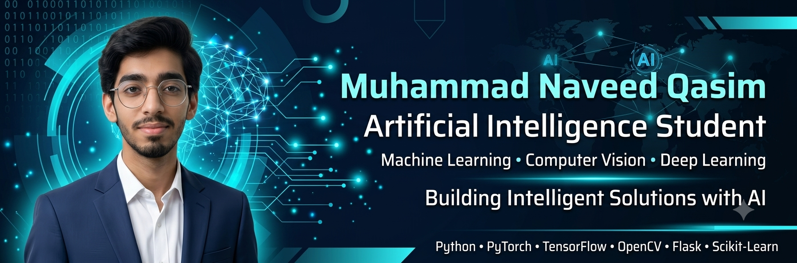

<h1 align="center">
Hi 👋, I'm Muhammad Naveed Qasim
</h1>

<h1 align="center">Hi 👋, I'm Muhammad Naveed Qasim</h1>

<h3 align="center">Artificial Intelligence Student | Machine Learning Enthusiast | Computer Vision Developer</h3>

  

  

---

# 💫 About Me

🎓 Artificial Intelligence undergraduate at **Riphah International University, Lahore**

🤖 Passionate about **Artificial Intelligence, Machine Learning, Deep Learning, Computer Vision, and Data Science**

💻 Currently building **AI-powered real-world applications** using Python and modern AI frameworks.

🚀 My flagship project is **LockIn**, an AI-powered Face Recognition Attendance System featuring **FaceNet, OpenCV, Flask, and Liveness Detection**.

🌱 Currently learning:
- Large Language Models (LLMs)
- MLOps
- Advanced Computer Vision
- Deep Learning

🎯 Goal: To become an AI Engineer developing intelligent systems that solve real-world problems.

---

# 🌐 Connect With Me

---

# 💻 Tech Stack

## 🚀 Languages

---

## 🤖 AI & Machine Learning

---

## 📊 Data Science

---

## 🗄️ Databases

---

## ⚙️ Frameworks & Tools

---

# 🚀 Featured Projects

### 🔐 LockIn — AI Face Recognition Attendance System
- Face Recognition using FaceNet
- Liveness Detection
- Flask Backend
- OpenCV
- Real-Time Attendance

### 🧠 Brain Tumor Segmentation
- U-Net
- TensorFlow
- Medical Image Processing

### 🌍 WanderLust
- Tourist Management System
- Flask
- MySQL

### 🌦️ Weather & Air Quality Monitoring
- PyQt5
- OpenWeather API

### 📊 Customer Churn Prediction
- Machine Learning
- Scikit-Learn
- Pandas

---

# 📈 GitHub Stats

---

# 🏆 GitHub Trophies

---

# 📈 Contribution Graph

---

# ✍️ Random Dev Quote

---

# 🐍 Contribution Snake

---

# 📫 Let's Collaborate

I'm always interested in collaborating on:

- 🤖 Artificial Intelligence
- 🧠 Machine Learning
- 👁️ Computer Vision
- 📊 Data Science
- 🌐 Open Source Projects

Feel free to connect with me!

---

<h3 align="center">

⭐ Building intelligent systems that solve real-world problems through Artificial Intelligence.

</h3>

## Hi there 👋

<!--
**Naveed-Qasim608/Naveed-Qasim608** is a ✨ _special_ ✨ repository because its `README.md` (this file) appears on your GitHub profile.

Here are some ideas to get you started:

- 🔭 I’m currently working on ...
- 🌱 I’m currently learning ...
- 👯 I’m looking to collaborate on ...
- 🤔 I’m looking for help with ...
- 💬 Ask me about ...
- 📫 How to reach me: ...
- 😄 Pronouns: ...
- ⚡ Fun fact: ...
-->

<!-- Snake Game Repo View -->

  

